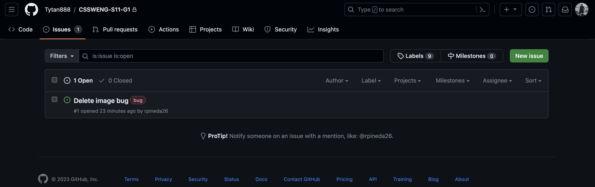
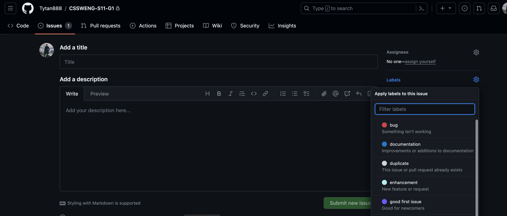
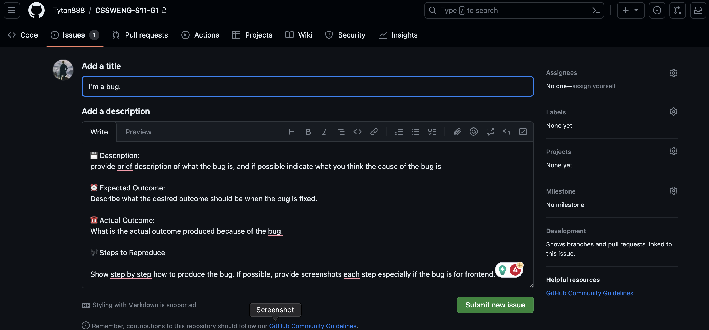

## CSSWENG-S11-G1

🌔 ***To run the server...*** 
Create a .env file in the root folder of the repository.
```
vim .env
```
In the .env file, include all the necessary variables.
```
PORT = 'Port number'
MONGODB_URI = 'mongodb://localhost:27017/pearldb'
TEST_MONGODB_URI = 'mongodb://localhost:27017/test'
SALT_ROUNDS = 'can be any number higher than 0'
SECRET ='Any strong password'
WEBHOOK_SECRET_KEY = 'The secret key of the paymongo webhook'
PAYMONGO_SECRET_KEY_HASH = 'The hash key generated from the paymongo secret key'
WEBSITE_URL = 'https://hostaddress:PORT'
DONATION_DISABLED = 'true or false'
```

------

Then run the server by typing this command in the terminal...
```
node start.js
```

🔱 ***For developers...***
```
npm test
```
- Run this to automatically test functions.
- Alternatively, VSCode has a Jest extension that automatically checks the tests when code is updated.

```
npm run dev
```
- Run this to start the server with Nodemon.

```
npm run doc
```
- Run this to export documentation in HTML through JSDoc.

------
  
✅ **Naming Convention**
- word_word2_word3 :  Underscore Notation for File Names
- wordWordWord: Camel Case for Functions, Objects, Variables
- word-word-word: Kebab-Case for Image Names
  
🚀 **git commit**
- add: introduce a new feature (even when incomplete)
- cont: continue a feature and still incomplete when committing
- feat: feature is fully complete upon committing
- refactor: change code (copy pasting to different file or renaming things)
- doc: inserting comments inside the code
- fix (bug name): fixing a bug, indicate if fully solved

------

📖 ***To check the test coverage report...***
- open this file: [CSSWENG-S11-G1/coverage/Icov-report/index.html](/coverage/lcov-report/index.html) with a browser

------

✉️ ***Guideline to Reporting Bugs***

1. Create a new issue via github.

2. Set the issue label as a bug.

3. Provide a title that is descriptive of the bug and follow the template for the description.

4. Submit the issue and make sure to notify the group of the newly created issue.

------

--- Copy-paste the bug report template below. ---

💾 Description:
Provide brief description of what the bug is, and—if possible—indicate what you think the cause of the bug is.

⏰ Expected Outcome:
Describe what the desired outcome should be when the bug is fixed.

☎️ Actual Outcome:
What is the actual outcome produced because of the bug?

🎶 Steps to Reproduce:
Show step-by-step how to produce the bug. If possible, provide screenshots for each step, especially if the bug is for the front-end.

---End of Copy-Paste---

------

--- Copy-paste the bug resolution template below. ---

🛠️ Fix:
Detail a description of how the issue was resolved in code.

☑️ New Output/Behavior:
Describe how the newly fixed feature behaves as intended. Provide detailed screenshots whenever possible.

---End of Copy-Paste---